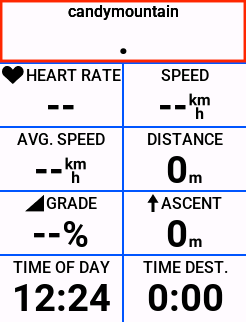

# GarminService Plugin for Loop

This repository contains the GarminService Plugin for the Loop iPhone app. This plugin provides real-time glucose data integration from the Loop app to Garmin devices, particularly useful for athletes like cyclists who require constant glucose monitoring without internet reliance.


**Disclaimer:** This is a DIY project intended for personal use. It is **NOT** a medical device and **should not** be used to make any medical decisions or treatments. The code comes with **no guarantees of reliability** or accuracy, and its use is entirely at the risk of the user. This service has been **only partially tested** and could cause Loop to crash, though this did not occur during testing. The creators and contributors take no responsibility for any outcomes resulting from the use of this plugin.

## Features
- Real-time glucose tracking directly on Garmin devices via Bluetooth.
- No internet required, avoiding delays and unreliable data common in other solutions.
- Integrates seamlessly with Loop.

## Prerequisites
- Garmin device with **API level 5.0 or higher**.  
  - You can check if your device is compatible [here](https://developer.garmin.com/connect-iq/compatible-devices/).
  - API level 5.0 is required to enable real-time Bluetooth communication, unlike the official Dexcom and iAPS datafields, which suffer from delays due to backend access every 5 minutes (leading to delays of up to 10 minutes).

## Installation

### 1. InstallData Field on your Garmin Device
1. Ensure your Garmin device supports the latest API level (5.0 or higher). Check if your device is compatible [here](https://developer.garmin.com/connect-iq/compatible-devices/).
2. Download the `Garmin.prg` file from [this repository](https://github.com/janvv/candymountain/tree/3-glucose-from-health/Garmin/bin).
3. Connect your Garmin device to your computer and copy the `Garmin.prg` file to the `Apps` folder of your Garmin device. Safely disconnect (eject) the Garmin device from your computer.
4. Add the data field labeled `sugar` to your Garmin data screens. You will find this under the **Connect IQ** section.
5. You will initially see "CandyMountain" with a waiting indicator (three dots), which appears when there has been no data in the last 10 minutes.

||||
| --- | --- | --- |


### 2. Install Loop with Garmin Service Plugin

The Garmin Service plugin (this repository) must be integrated into the Loop Workspace so that when you build Loop with Xcode, it will include this service plugin into the Loop application. I already made this integration. Therefore, the installation is almost identical with the official build instructions except that we pull the LoopWorkspace from my private fork:

1. Clone the LoopWorkspace (this pulls the modified Loop Workspace with Garmin Service integration)
    ```bash
    git clone --branch=garminservice --recurse-submodules https://github.com/janvv/LoopWorkspace.git
    ```
2. Change to the cloned directory and open the workspace in Xcode:
	* Open the `LoopWorkspace.xcworkspace` file from the cloned folder in Xcode 
	* Or use the command line
```bash
	cd LoopWorkspace
	xed .
```
3. Input your development team: 
* Select the `LoopConfigOverride` file in Xcode's project navigator uncomment the `LOOP_DEVELOPMENT_TEAM`, and replace the existing team id with your own id.
4. Build & Run on your Phone
	* **Note:** If you don't want to replace your current Loop instance, you can modify the `LoopConfigOverride.xcconfig` to install a second instance of Loop and try it out.
### 3. Setup Garmin Service in Loop
1. Open Loop and go to `Settings` → `Services` → `Add Services` → `Garmin Service`.
2. Tap **Connect Garmin Devices**. 
	1. This will open the Garmin Connect App and reopen Loop to import the available devices.
3. Once connected, the Garmin Service should list your available devices. Select your Garmin device. Make sure to tap it so that it shows a check.

||||
| --- | --- | --- |

## Source Code

The GarminService Plugin integrates with several repositories and codebases. Below are links to the relevant repositories and their descriptions:

- **[LoopWorkspace Fork](https://github.com/janvv/LoopWorkspace/tree/garminservice)**: This fork of LoopWorkspace includes the GarminService as a submodule and modifications to Loop's delegate to handle connections to Garmin Connect. Use this fork to build Loop with GarminService support.
  
- **[GarminService Repo](https://github.com/janvv/GarminService)**: (this repository). It contains the source code for the GarminService, a Loop plugin, which facilitates the communication between Loop and Garmin devices via Bluetooth, enabling real-time glucose data transmission.

- **[CandyMountain Repo](https://github.com/janvv/candymountain)**: provides the necessary Garmin datafield for displaying glucose data. This project was the early attempt to send glucose data directly from apple health. While this attempt didn't succeed as apple health becomes unaccessible while the phone is locked, it still cointains the code and a precompiled datafield called "sugar" for the datafield used in this project.

**Historical Background**: The basis for this project was [CandyMountain](https://github.com/janvv/candymountain). It's a companion iOS app that reads glucose data directly from Apple Health and sends it to the Garmin datafield. The datafield is still the one that we are using here. However, the approach failed due to Apple Health becoming inaccessible when the phone is locked, which rendered the app unusable for background glucose monitoring. Therefore, integrating with Loop directly became a more reliable solution to achieve real-time, background glucose tracking without these limitations. 

## Resources
- For more details on Garmin SDKs, you can reference:
  - [Garmin Connect IQ SDK Documentation](https://developer.garmin.com/connect-iq/overview/)
  - [Garmin Connect IQ iOS SDK](https://developer.garmin.com/connect-iq/core-topics/mobile-sdk-for-ios/)
  - [LoopKit Installation Guide](https://github.com/LoopKit/Loop/wiki/Build-Loop-App)
  - [LoopKit GitHub Repository](https://github.com/LoopKit/LoopWorkspace)

This service was built using the structure of the **Loogly Service** and **Nightscout Service**, both of which upload glucose data to the cloud via the RemoteDataService. Special thanks to the original authors of these services for their contributions to the Loop ecosystem.

## Feedback & Support
Feel free to open issues or discussions on this repository for any questions or feedback. This is an open-source DIY project, and contributions are welcome!

## License
All rights reserved © Jan Wrede 2024.

Permission is hereby granted to view and use the code in this repository for personal, non-commercial purposes only. No part of this project may be reproduced, distributed, or used for commercial purposes without explicit written permission from the author. Modification and redistribution of the source code are allowed for personal use only.

This project is provided “as-is” without any warranties or guarantees, including but not limited to reliability, accuracy, or fitness for a particular purpose. The author is not liable for any damage or loss resulting from the use of this code or project.

For further permissions or inquiries, contact the author directly.
